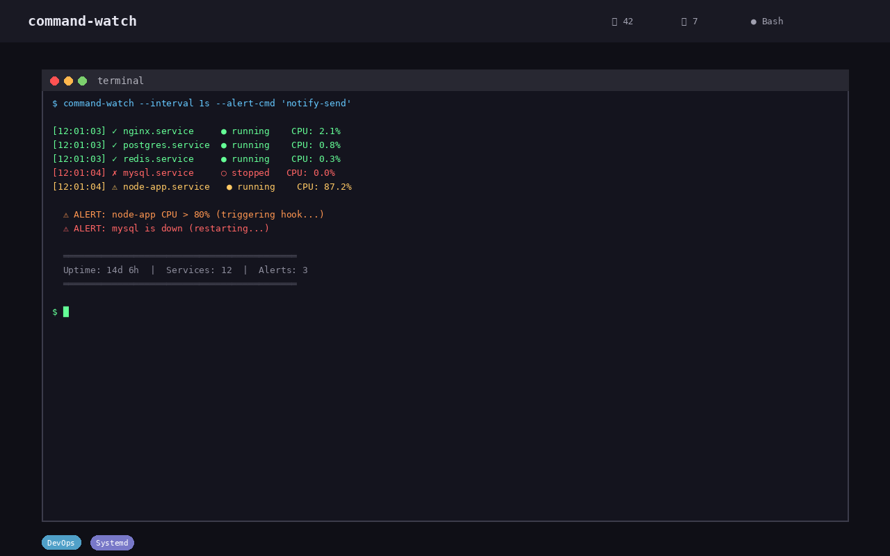

# Command Watch

[](https://github.com/stennu718/command-watch/actions/workflows/tests.yml)
[](https://opensource.org/licenses/MIT)
[](https://stennu718.github.io/command-watch/)
[](https://github.com/stennu718/command-watch/releases)
[](https://github.com/stennu718/command-watch/pkgs/container/command-watch)



## Description

Command Watch is a real-time strategy (RTS) game inspired by the classic Command & Conquer series. Build your base, manage resources, and destroy your opponent's Command Center — all in real-time. Play against another human or challenge the built-in AI opponent.

## Features

- **Real-time strategy gameplay** — Classic RTS mechanics with units, buildings, and base management
- **AI opponent** — A fully strategic computer player that challenges you with complete game logic
- **Fog of War** — Only see areas near your units; the map reveals itself as you explore
- **Resource management** — Collect ore, build structures, and manage production chains
- **Audio** — Sound effects and background music for an immersive experience

## How to Play

### Buildings

- **Power Plant** — Provides power to your base
- **Ore Refinery** — Processes harvested ore into resources
- **Barracks** — Trains infantry units
- **War Factory** — Produces vehicles and heavy units
- **Defense Turret** — Automatically attacks nearby enemies

### Units

- **Harvester** — Collects ore and delivers it to the refinery
- **Infantry** — Basic foot soldiers
- **Light Tank** — Fast armored vehicle

### Objective

Destroy the enemy's **Command Center** to win the game. Manage your economy, build your army, and strike before they do.

## Quick Start

```bash
npm install
npm run dev
```

The game will be available at `http://localhost:3000`.

## Tech Stack

- **Language:** TypeScript 5+
- **Framework:** React 19
- **Build Tool:** Vite 6
- **Testing:** Vitest
- **Styling:** Tailwind CSS 4
- **CI/CD:** GitHub Actions
- **Deployment:** Docker

## Project Structure

```
command-watch/
├── src/
│   ├── game/
│   │   ├── Engine.ts      # Core game engine and state management
│   │   ├── AiLogic.ts     # AI opponent decision-making
│   │   ├── entities.ts    # Game entity definitions
│   │   ├── types.ts       # TypeScript type definitions
│   │   ├── constants.ts   # Game constants and configuration
│   │   └── Audio.ts       # Audio system
│   ├── App.tsx            # Main application component
│   ├── main.tsx           # Entry point
│   └── index.css          # Global styles
├── tests/                 # Unit and integration tests
├── .github/workflows/     # CI/CD pipelines
├── Dockerfile             # Container configuration
├── vite.config.ts         # Vite configuration
├── vitest.config.ts       # Vitest configuration
└── tsconfig.json          # TypeScript configuration
```

## Screenshots


## Contributing

See [CONTRIBUTING.md](CONTRIBUTING.md) for details.

## License

This project is licensed under the MIT License — see the [LICENSE](LICENSE) file for details.
