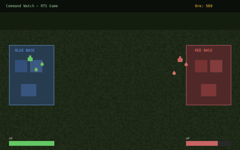

# Command Watch

[](https://github.com/stennu718/command-watch/actions/workflows/tests.yml)
[](https://opensource.org/licenses/MIT)
[](https://github.com/stennu718/command-watch/releases)
[](https://github.com/stennu718/command-watch/pkgs/container/command-watch)


A classic real-time strategy (RTS) game inspired by the Command & Conquer series. Build your base, manage resources, and destroy your opponent's Command Center — all in real-time directly in your browser.

## Live Demo

**► [Play Online](https://stennu718.github.io/command-watch/)**

## Description

Command Watch is a browser-based real-time strategy game built with React and TypeScript. It features classic RTS mechanics including base building, resource harvesting, unit production, and tactical combat. Play against another human or challenge the built-in AI opponent.

The game renders on an HTML5 Canvas with a custom game engine handling entity management, pathfinding, fog of war, projectile physics, and AI decision-making — all running at 60fps in the browser.

## Demo



## Try it

🎮 **[Try Live Demo](https://stennu718.github.io/command-watch/demo/)** — watch AI vs AI battle, play against AI

Or run locally:
```bash
npm install && npm run dev
```

## Features

- **Real-time strategy gameplay** — Classic RTS mechanics with units, buildings, and base management
- **AI opponent** — A fully strategic computer player that builds, scouts, attacks, and defends
- **Fog of War** — Only see areas near your units; the map reveals itself as you explore
- **Resource management** — Harvest ore with harveyors, manage credits, and balance production
- **Multiple unit types** — Harvesters, infantry, and light tanks with distinct behaviors
- **Defensive structures** — Auto-targeting turrets to protect your base
- **Audio** — Sound effects for unit readiness and gameplay feedback
- **Responsive canvas rendering** — Smooth camera panning, selection boxes, and isometric-style 3D building rendering

## How to Play

### Objective

Destroy the enemy's **Command Center** to win the game. Manage your economy, build your army, and strike before they do.

### Controls

| Action | Control |
|--------|---------|
| Select unit | Left-click |
| Select multiple | Left-click + drag |
| Move / Attack | Right-click on destination |
| Pan camera | Move mouse to screen edges |
| Build | Click a build button, then click on the map |

### Buildings

| Building | Cost | Function |
|----------|------|----------|
| **Command Center** | — | Your base. If destroyed, you lose. |
| **Power Plant** | 300 | Provides power to your base |
| **Ore Refinery** | 500 | Processes harvested ore; enables harvesters to unload |
| **Barracks** | 300 | Trains infantry units |
| **War Factory** | 800 | Produces harvesters and vehicles (tanks) |
| **Defense Turret** | 400 | Automatically attacks nearby enemies |

### Units

| Unit | Cost | Trained At | Role |
|------|------|------------|------|
| **Harvester** | 600 | War Factory | Collects ore and delivers to refinery |
| **Infantry** | 100 | Barracks | Basic foot soldiers (cheap, fast) |
| **Light Tank** | 800 | War Factory | Heavy armored vehicle (slow, powerful) |

## Quick Start

### Run Locally

```bash
git clone https://github.com/stennu718/command-watch.git
cd command-watch
npm install
npm run dev
```

The game will be available at `http://localhost:3000`.

### Run with Docker

```bash
docker run -p 3000:3000 ghcr.io/stennu718/command-watch
```

### Build for Production

```bash
npm run build
npm run preview
```

## Architecture

Command Watch is built with a **custom canvas-based game engine** integrated into a React UI shell. Here's how the pieces fit together:

### Tech Stack

- **Language:** TypeScript 5+
- **UI Framework:** React 19 (for HUD/menus, not game rendering)
- **Rendering:** HTML5 Canvas 2D (game world)
- **Build Tool:** Vite 6
- **Testing:** Vitest + React Testing Library
- **Styling:** Tailwind CSS 4
- **CI/CD:** GitHub Actions (tests, Docker build, Pages deploy)
- **Deployment:** Docker + GitHub Pages

### Architecture Overview

```
┌─────────────────────────────────────────────────┐
│                  React (App.tsx)                 │
│  ┌────────────────────────────────────────────┐ │
│  │          Game HUD / Overlay                  │ │
│  │  Credits, Power, Build Menu, Status         │ │
│  └────────────────────────────────────────────┘ │
│                      │                           │
│              GameState (callbacks)               │
│                      │                           │
│  ┌────────────────────────────────────────────┐ │
│  │        HTML5 Canvas (Game World)            │ │
│  │  ┌──────────────────────────────────────┐  │ │
│  │  │         GameEngine                    │  │ │
│  │  │  ┌─────────┐ ┌─────────┐ ┌────────┐ │  │ │
│  │  │  │ Entities│ │ AI Logic│ │  FOW   │ │  │ │
│  │  │  │ Manager │ │ System  │ │ System │ │  │ │
│  │  │  └─────────┘ └─────────┘ └────────┘ │  │ │
│  │  │  ┌─────────┐ ┌─────────┐ ┌────────┐ │  │ │
│  │  │  │ Terrain │ │ Physics │ │ Audio  │ │  │ │
│  │  │  │ Renderer│ │(units,   │ │ System │ │  │ │
│  │  │  │         │ │projectiles)│ │       │ │  │ │
│  │  │  └─────────┘ └─────────┘ └────────┘ │  │ │
│  │  └──────────────────────────────────────┘  │ │
│  └────────────────────────────────────────────┘ │
└─────────────────────────────────────────────────┘
```

### Core Modules

| Module | File | Purpose |
|--------|------|---------|
| **Game Engine** | `src/game/Engine.ts` | Main loop, entity management, input handling, game state |
| **AI Logic** | `src/game/AiLogic.ts` | AI decision-making: scout, attack, defend, search |
| **Entities** | `src/game/entities.ts` | Building, Unit, Ore, Projectile classes with shared Entity base |
| **Types** | `src/game/types.ts` | TypeScript type definitions (PlayerId, BuildingType, UnitType, Position, etc.) |
| **Constants** | `src/game/constants.ts` | Game balance data: costs, build times, stats, map size |
| **Audio** | `src/game/Audio.ts` | Sound effects management |
| **App** | `src/App.tsx` | React component wrapping the canvas and rendering HUD overlay |
| **Entry** | `src/main.tsx` | React app entry point |

### Game Loop

The engine runs a `requestAnimationFrame` loop at ~60fps:

1. **`update(dt)`** — Advances all game systems:
   - Camera panning (edge-scroll)
   - Build queue progress
   - Unit AI/state machine (idle → moving → harvesting → returning)
   - Building logic (turret targeting/firing)
   - Projectile movement and collision
   - AI strategic decisions
   - Fog of war recalculation

2. **`draw()`** — Renders the frame:
   - Terrain (pre-rendered to offscreen canvas)
   - Ore patches
   - Buildings (with 3D bevel effect)
   - Units (colored by player)
   - Projectiles
   - Selection box
   - Fog of war overlay

### AI System

The built-in AI opponent operates on two levels:

- **Strategic (state machine):** Progresses through build phases — power → refinery → barracks → war factory → unit production spam
- **Tactical (per-frame decisions):** Each military unit evaluates its context and chooses to scout, attack known enemies, search randomly, or return to defend the base if threatened

### Fog of War

Implemented as a grid of visibility cells. Each frame, cells within unit sight radius are revealed. Unrevealed areas are drawn black; previously-seen but currently-out-of-sight areas are dimmed.

### State Management

The game engine maintains all mutable state internally and communicates with React via a callback (`onStateChange`). This keeps the hot game loop independent of React's render cycle for performance.

## Project Structure

```
command-watch/
├── src/
│   ├── game/
│   │   ├── Engine.ts      # Core game engine and main loop
│   │   ├── AiLogic.ts     # AI opponent decision-making
│   │   ├── entities.ts    # Game entity classes (Building, Unit, Ore, Projectile)
│   │   ├── types.ts       # TypeScript type definitions
│   │   ├── constants.ts   # Game balance: costs, stats, sizes
│   │   └── Audio.ts       # Audio system
│   ├── App.tsx            # Main React component with HUD
│   ├── main.tsx           # React entry point
│   └── index.css          # Global styles (Tailwind)
├── tests/                 # Unit and integration tests (Vitest)
│   ├── setup.ts
│   ├── Engine.test.ts
│   ├── AiLogic.test.ts
│   ├── Ai.test.ts
│   └── Constants.test.ts
├── .github/workflows/     # CI/CD pipelines
│   ├── tests.yml
│   ├── pages.yml
│   └── docker.yml
├── screenshots/           # Screenshots for documentation
├── Dockerfile             # Container configuration
├── vite.config.ts         # Vite configuration
├── vitest.config.ts       # Vitest configuration
├── tsconfig.json          # TypeScript configuration
├── package.json           # Dependencies and scripts
└── LICENSE                # MIT License
```

## Testing

```bash
# Run all tests
npm test

# Run tests in watch mode
npm run test:watch

# Run tests with UI
npx vitest --ui
```

Tests cover:
- Engine initialization and game state
- Unit movement and AI behavior
- AI decision logic (scout, attack, defend, search)
- Game constants and balance values

## Contributing

See [CONTRIBUTING.md](CONTRIBUTING.md) for setup instructions, coding guidelines, and PR process.

## License

This project is licensed under the MIT License — see the [LICENSE](LICENSE) file for details.
